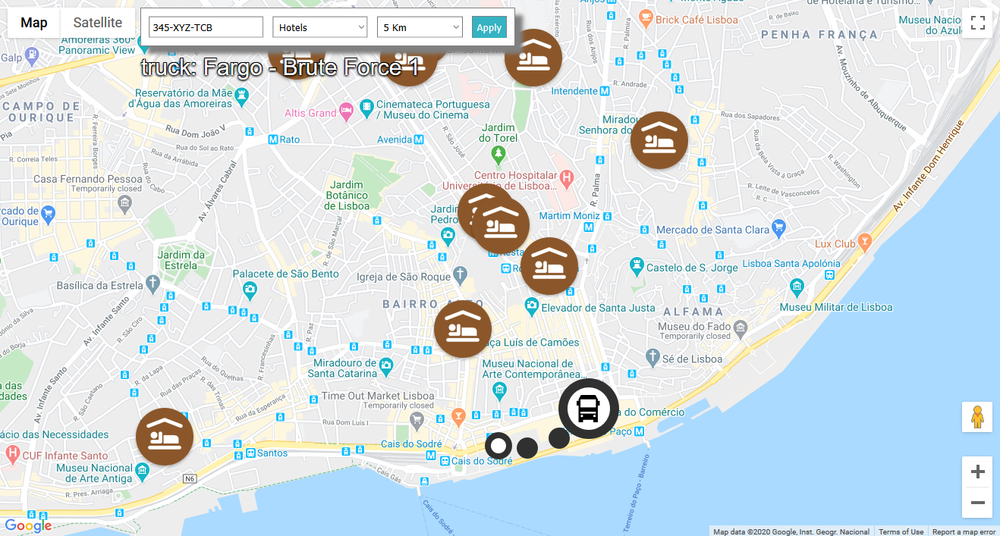

# Service Care
By: Rui Anastácio - April 2020

This project is a code challenge proposed by MAN. It consists of a Web application that displays truck location and nearby points of interest.

Has two components:

- A backend app written in Java Spring Boot, called truck-service. This service implements a REST API that provides information about the
 truck and it's last locations. More info here: [Truck-Service](backend/truck-service/README.md)

- A frontend app (monitor) written in React, that displays the truck location on the Map, and let's users find nearby points of interest. 
More info here: [Monitor](frontend/monitor/README.md)

## Screenshots

Some screenshots explained:

A search for truck with license plate 345-XYZ-TCB, and nearby restaurants, displays it's location along the points of interest. Below the filters the truck Brand  and Model are displayed. Satellite view is displayed.

Same search in Map view, and different zoom.

A different search shows truck Opel - Model XYZ, and nearby restaurants. Notice the information displayed as Tooltip when mouse overs the marker.
